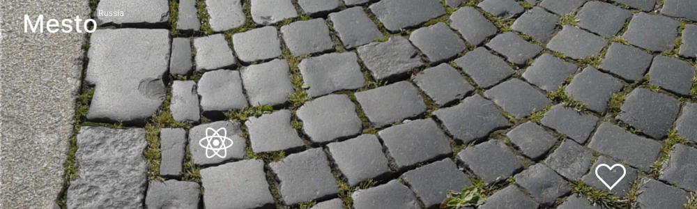

# Проект: Mesto Russia (React)

## О проекте
Перед вами одностраничный сайт-приложение, выполненный в рамках обучения в Яндексе Практикуме
по программе Веб-разработчик.

Основа проекта создавалась в течение третьего курса (модуля) обучения "Базовый JavaScript и четвёртого курса (модуля) "JavaScript — непростые концепции"работа с браузером": ноябрь 2022 — февраль 2023 года.
Проект выполнялся поэтапно, что подразумевает постепенное усложнение страницы, постепенное появление новых функций, реакторинг.

Текущая итерация проекта: реализация функций регистрации, входа и авторизации сервиса.

В курсе (модуле) "Интерфейсы с использованием React" код проходил через итерации реакторинга:

  upd 15.03.2023 - Проектная работа 11 - Добавлен контекст currentUser, доавлена возможность: ставить лайки, дабавлять и удалять свои карточки, редактировать профиль и аватар;

  upd 31.03.2023 - Проектная работа 12 - Добавлена регистрация, вход и авторизация пользователя.

#
* [Ссылка на проекта до портирования на React](https://github.com/EliseyE/mesto)

* [Ссылка на сайт проекта](https://eliseye.github.io/mesto-react/index.html)

* [Ссылка на макет в Figma 1](https://www.figma.com/file/2cn9N9jSkmxD84oJik7xL7/JavaScript.-Sprint-4?node-id=0%3A1)

* [Ссылка на макет в Figma 2](https://www.figma.com/file/bjyvbKKJN2naO0ucURl2Z0/JavaScript.-Sprint-5?node-id=0%3A1)

* [Ссылка на макет в Figma 3](https://www.figma.com/file/kRVLKwYG3d1HGLvh7JFWRT/JavaScript.-Sprint-6?node-id=0%3A1)

* [Ссылка на макет в Figma 4](https://www.figma.com/file/PSdQFRHoxXJFs2FH8IXViF/JavaScript-9-sprint?node-id=0%3A1)

* [Ссылка на макет в Figma 5](https://www.figma.com/file/5H3gsn5lIGPwzBPby9jAOo/Sprint-14-RU?node-id=0%3A1)

Благодаря команде, подготовившей дизайн, на сайте вы можете увидеть:

* Шапку сайта;
* Фотогалерею;
* Подвал сайта;
* Форму регистрации и входа в аккаунт;
* Модельные окна:
  1) Редактирования данных профиля пользователя;
  2) Добавления новой карточки с фотографией в галерею профиля;
  3) Открытия (разварачивания) фотографии из галереи;
  4) Редактирования аватара;
  5) Подтверждения удаления карточки;
  6) Сообщения об успешной регистрации или ошибке.

О правах и лицензиях:

* Шритф Inter имеет свободную и открытую лицензию.

## Технологии

Проект реализован на основе таких технологий как:

* Языки разметки и программирования: HTML, CSS, JavaScript, JSX

    

* React;

  

* БЭМ;
* Файловая структура БЭМ (Nested);
* Flex-блоки;
* Grid Layout;
* Promise, fetch и взаимодействие с API;
* Реализована адаптивность интерфейса благодаря использованию медиазапросов - директивы *media*
  с контрольными размерами экрана 1280px и 320px;
* Анимация декоративных элементов и элементов управления, плавность открытия модальных окон;
* Алгоритмы JavaScript и JSX реализуют:

  1) Автозаполнение данных профиля и фотогалереи карточками при первой загрузке страницы. Данные загружатся с сервера из данных профиля пользователя;
  2) Кнопка редактирования профиля при нажатии открывает выплывающее окно формы редактирования профиля;
  3) Работа формы редактирования профиля:
      * Автоматическое заполнение полей ввода текущими значениями профиля;
      * Невозможность сохранить данные профиля с хотя бы одним пустым полем;
      * Возможность закрытия формы редактирования профиля без сохранения изменений;
      * Возможность сохранить изменения данных профиля с последующим автоматическим закрытием окна формы редактирования. Показан момент обработки данных.
  4) Кнопка добавления новой карточки в галерею при нажатии открывает выплывающее окно формы добавления новой карточки;
  5) Работа формы добавления новой карточки в галерею:
      * Невозможность добавить карточку с хотя бы одним пустым полем или неверной ссылкой;
      * Возможность закрытия формы добавления;
      * Возможность добавления новой карточки в галерею с последующим автоматическим закрытием окна формы редактирования. Показан момент обработки данных.
  6) Зактытие форм возможно по кнопке - кретику, нажатием кнопки Escape, по тапу на overlay;
  7) Клик по аватару открывает выплывающее окно формы изменения аватара профиля;
  8) Работа формы редактирования аватара профиля:
      * Невозможность сохранить данные профиля с пустым полем;
      * Возможность закрытия формы редактирования профиля без сохранения изменений;
      * Возможность сохранить изменения данных профиля с последующим автоматическим закрытием окна формы редактирования. Показан момент обработки данных.
  9)  Форма подтверждения удаления карточки фотографии вызывается после нажатия на кнопку удаления на карточке фоторафии;
  10) Работа формы подтверждения удаления карточки фотографии, добавленной пользователем:
      * Возможность закрытия формы подтверждения удаления без подвердения удаления;
      * Возможность подтверждения удаления с последующим автоматическим закрытием окна формы подтверждения удаления. Отрисован момент обработки данных.
  11) Валидация
      * на данном этапе не настроена.
  12) Клик по кнопке лайка добавялет пользователя в список пользователей, которые поставили лайк данной карточке с фотографией. Повторное нажатие на кнопку лайка убирает пользователя из списка пользователей, которые поставили лайк. Счётчик лайков каждый раз после клика по кнопке лайк обновляется.
  13) Форма регистрации позволяет при корректном заполнении данных зарегистрироваться в сервисе.
  14) Форма входа позволяет при корректном заполнении данных получить права доступа к данным профиля и самого сервиса.
  15) Клик по кнопке Выход позволяет выйти из сервиса.
  16) Маршрутизация не позволяет без авторизации получить доступ к защищенной части приложения.

## Функциональность

* Возможеность открывать страницу на устройствах различной шириной от 320px.
  Таким образом, страницу удобно читать как с экрана компьютера, так и с экранов мобилных устройств;
* На странице возможно:
  1) Просмотр карточек пользователей сервиса.
  2) Открытие (разварачивание) фотографии из галереи в отдельном окне;
  3) Изменение данных пользователя;
  4) Изменение аватара пользователя;
  5) Добавление карточки фотографии;
  6) Удаление карточки фотографии;
  7) Возможность ставить у снимать лайки карточек фотографий.
  8) Зарегистрироваться в сервисе;
  9) Войти и авторизоваться для получения данных сервиса;
  10) Выйти из профиля.

## Планы
Добавить валидацию форм, провести по возможности рефакторинг кода.

***last update 31/03/2023***
